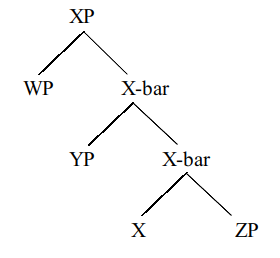
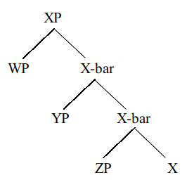
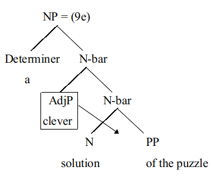
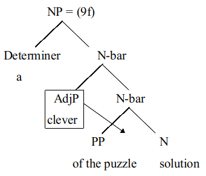

# 刺激貧乏 — 你母語學得很少，卻懂得很多，為什麼？Explanatory adequacy and Poverty of Stimulus

* Chomsky 除了將語法研究放入語言學研究議題中，他也在 Chomsky (1959) 這篇著作中針對人類的母語知識發展，提出**刺激貧乏論證 (Poverty of Stimulus, POS)**。
* 母語知識發展的 POS 是引導認知科學發展的一個關鍵論證，其核心觀察為健康人類幼兒不需大量地、有系統性地語言接觸與教導，就能夠在有限的時間內成長為具備精熟穩定語言知識的母語使用者 (Chomsky 1980; Nowak et al. 2001; Yang 2013) \[1]&#x20;
  * 實際的觀察裡也可以發現，人類幼童在一歲半就能說出短但合文法的句子 (e.g., 太陽出來了，要帶帽子)。而人類幼童絕大多數的時間都在睡覺 (每天 13 \~ 14 小時)，剩下時間的主要照顧者通常不是很多人，環境也不是很多變的情況下，語言刺激相對地少。但就這麼少的刺激，即足以讓每個正常人類幼童發展出完整的語言能力。
* 他也提出 1920 年代至 1950 年代之間，美國心理學界盛行的行為主義 (behaviorism) 倡導的刺激-反饋學習 (stimulus-response learning) 無法涵蓋母語知識的全貌，也無法解釋其發展的機制。
  * 人類幼童會說出自己創造的新詞，例如「牙刷醬、蜂蜜蟲」…等等。在英文環境下也可注意到幼兒說出錯誤的 "goed" (正確的字應該是 went) 或是 "gooses" (正確的字應該是 geese) 這些字眼。因為這些新詞或是錯字都是成年大人不曾在幼童面前提過的，但幼童卻會自行造詞，可見人類的語言能力不是由「大量刺激，形成反射，進而學習」而來。而是另有一個位於心智內部的演算法在運作著。
* 英語母語者都可以第一眼就判斷下例 (1b), (2b), (3b) 都是不合文法的，中文母語者可以第一眼就判斷下例 (4) 是不合文法的。而且把不合文法的句子讀一萬遍、十萬遍，也不會讓它變得合文法。但是在人類幼童成長過程中，父母、照顧者、同儕從來都不會針對這幾種句子提出明確以及系統性的教導，告訴孩童「這個句子的文法是錯的歐！」，因此這個母語者的判斷能力並不是來自外在環境的刺激以及制約式學習 (即正增強與負增強的形塑過程)，而是如同前段所述，另有一個位於心智內部的演算法在運作者。母語使用者在成長的過程中，自然會發展出判斷什麼是「不合文法的句子」的能力。
* (1)&#x20;
  * a.  Who did Sam think solved this puzzle?
  * b. \*Who did Sam think **that** solved this puzzle?
* (2)
  * a.  What do the authors think \_\_\_\_\_ caused this problem in ChatGPT?
  * b. \*What do the authors think **that** \_\_\_\_\_ caused this problem in ChatGPT?
* (3)
  * a. Who does John want \_\_\_ to solve the problem?
  * b. \*Who does John **wanna** solve the problem?
* (4) 椅看一有子我天把坐
* _<mark style="color:blue;">**\[註] 語言學中，將一個句子的開頭打上星號 \* 表示這個句子不合文法；若打上問號，則表非句子不自然。**</mark>_
* Chomsky 強調外在環境的刺激與引導當然是母語知識發展的必要條件，但絕不是充分條件。
  * 意即，幼童語言能力的發展需要外部環境的刺激，這是必要條件，同時也需要大腦中內建完善的語言演算法，這是充份條件。只有必要條件，而缺乏充份條件，語言能力將異常發展 (e.g., 發展遲緩)；只有充份條件而缺乏必要條件，語言能力將呈現無法發展 (e.g., 仿語)
* 因為母語知識的全貌是無法全然由外在環境刺激決定的，特別是像前述 4 組病句這類負面語言知識 (negative evidence)，由於是不合法句，因此不會被日常成長環境中被使用，人類孩童便沒有機會接觸到這類語言知識 (Bowerman 1988; Marcus 1993)。若要說「因為沒聽過，所以就是錯的」，又偏偏每天聽到的句子幾乎都是沒聽過的、新的句子。因此，只以「有沒有聽過來判斷是否正確」並不合理。換句話說，母語知識的全貌大於環境刺激的總和，所以人類孩童絕不是只倚靠刺激反饋的制約式學習機制，來發展母語知識。
* POS 也適用於中文母語者的知識發展。舉例來說，中文母語者都可以判斷下例 (5a) 之中的反身代名詞「自己」的語意解釋可以指張三，也可以指李四。有趣的是，(5b) 的反身代名詞「自己」只有一個意思，只能指說話者「我」，無法指主句主詞「張三」(詳見 Huang & Liu 2001 的相關討論)。
* (5)
  * a. 張三認為李四不該看不起自己。
  * b. 張三認為我不該看不起自己。
* 中文母語者對 b) 的理解也是一種負面語言知識，「自己不能指張三」這個語意判斷不會出現在成長教育環境中，不會有成人明確地指出「這個句子沒有這個意思」，因此純然倚靠外在環境的學習機制是無法解釋中文母語者是如何取得這類母語知識的。
* 除此之外，每個英語/中文母語者成長受教育的背景不一致，受到的語言刺激必然有差異，然而，英語/中文母語者對於前述病句的判斷卻是一致的，若母語知識都來自外在刺激反饋，那麼每個人受到的語言刺激必然有差異，母語知識不應該會如此一致。
* 或許有人會認為這類負面語言知識可以從外在環境刺激推導而來，一個句子不合語法，或是缺乏某個語意解釋可以來自「我沒聽過有人這樣說或用這個句子表達這個意義」，所以母語者得以推斷這個句子不合法或是缺乏特定意義。
* 然而，這個論證的形式「X 語句 / 語意沒出現過，所以 X 語句不合法 / 語意不存在」並不恰當，如威廉·馮·洪堡所說，語言是一個無上限的創造力系統，因此我們是無法窮盡體驗所有可能的語句的，也總是會接觸到沒有聽過的語句，但我們仍然能夠穩定地判斷沒有聽過的語句是否合乎母語語法，或是否可以表達某特定語意，並不是沒有聽過某語句，就代表該語句是不合法或是缺乏某特定語意。
* Chomsky 針對負面語言知識的論證，想要強調的重點是母語知識不全是對環境表象刺激的反饋，母語知識這個創造力系統是被先天規範的，是在特定規範範圍中成長的 (Epstein 2016)，而這個規範範圍是無法由行為主義的刺激-反饋學習機制推導出來的。
* Chomsky 根據以上的論證，提出語言天性說 (nativism)，認為人類這類生物必然有語言習得的生物本能 (language-ready)，這個生物本能在生成語法理論中被稱為「普遍語法」 (Universal Grammar)，之所以稱為「普遍」是因為這個語法藍圖可以適用於人類所有可能的語言發展，無論發展的母語是英語、中文、日語、或是冰島語。
* 普遍語法引導健康的人類孩童在特定的規範下，去探索人類語言的可能樣貌與輪廓，在這個受到限制的學習機制下，人類孩童才有可能在有限的時間內，成長為精熟穩定的母語使用者，即使每個人在成長環境中獲得的語言刺激的質與量不一致，但對於母語的語句，即使沒有聽過，也可以產生一致性的合法性或是語意判斷。
* 在天性說的假設下，語言學家的爭論點在於各類語法理論的解釋適切性，也就是「普遍語法的內涵與細節」：語法知識有多少成分來自先天普遍語法? 有多少成分來自後天環境刺激?[\[2\]](ci-ji-pin-fa-ni-mu-yu-xue-de-hen-shao-que-dong-de-hen-duo-wei-shen-mo-explanatory-adequacy-and-pover.md#id-2-ren-lei-hai-tong-de-yi-cheng-gong-fa-zhan-mu-yu-zhi-shi-lai-zi-wu-san-da-bi-yao-tiao-jian-de-hu-do)
* 針對這個二分法問題，Chomsky (1981, 1986) 提出了原則-參數語法 (Principles-and-Parameters)，原則對應至各種語言的語法恆常性 (先天普遍語法)，參數設定對應至後天設定導致的語法差異 (後天環境刺激)。以下以「詞組結構」(phrase structure) 作為範例，說明母語習得的原則與參數。
* Chomsky (1970, 1973) 為了使生成語法理論變得更有普世應用性 (即所有自然語言都適用)，採用了 ) 之中的 X-bar 結構樹藍圖 (Jackendoff 1977; Stowell 1981)，來描繪所有自然語言之中，所有可能詞組的結構，也就是詞組結構的普遍語法。
* 在此結構藍圖中，X 為一變項，適用於所有詞類 (如名詞、動詞、形容詞等)，一個詞組 XP 必定有中心語 X，而中心詞可以與其適配的其他詞組 (即 ) 之中的 WP，YP 與 ZP) 成對融接，逐步組成一個完整的詞組 XP。
*   (6)

    <figure><figcaption></figcaption></figure>
* 我們可以觀察到 ) 中的WP，YP 與 ZP 在不同的階層進入構建 XP 的過程，最先與中心語 X 融接的是 ZP 補足語 (complement)，接著是 YP 附加語 (adjunct)，最後是 WP 指示語 (specifier)[\[3\]](ci-ji-pin-fa-ni-mu-yu-xue-de-hen-shao-que-dong-de-hen-duo-wei-shen-mo-explanatory-adequacy-and-pover.md#id-3-zhe-xie-bu-zu-yu-fu-jia-yu-zhi-shi-yu-bing-bu-shi-mei-ge-ci-zu-dou-bi-ran-cun-zai-er-shi-yi-zhong)。
* 我們可以將這樣的 X-bar 結構視為一個語言刺激過濾器，或是一種模具 (mold)，孩童使用相同的結構模具過濾接收到的線性字串刺激，將其轉化為成對融接的 X-bar 幾何結構。舉例來說，名詞字串可以被分析為如 (7a) 的 X-bar 結構、動詞字串可以被分析為如 (7b) 的X-bar 結構[\[4\]](ci-ji-pin-fa-ni-mu-yu-xue-de-hen-shao-que-dong-de-hen-duo-wei-shen-mo-explanatory-adequacy-and-pover.md#id-4-ai-wu-kong-jian-xian-zhi-wo-men-ci-chu-bu-zhan-shi-qi-ta-ci-zu-yi-ji-zi-ju-de-xbar-jie-gou-you-xin)。
*   (7)

    * a

    .png>)

    * b

    .png>)
* 生成語言學家認為上述一致性的結構模組可作為母語知識發展的規範，引導孩童在規範內以有效率的方式，將接受到的線性字串轉化為規律的幾何階層結構。
* 此外，這個結構模組保有彈性，可藉由後天的語言刺激，設定中心語位置參數 (head parameter)，決定一個語言的中心語是在補足語之前，如 (8a) 中的 X 在 ZP 之前，或是在補足語之後，如 (8b) 中的 X 位置在 ZP 之後。
*   (8)

    * a

    
<figure><figcaption></figcaption></figure>

    * b

    \

* 最後，X-bar 結構模組在描述適切性以及解釋適切性上還有一大優勢：它能預測什麼樣的字序是不可能存在的。
* 在描述適切性的層面上，中心語、補足語以及附加語三項元素的排列組合，邏輯上有 (9) 之中列舉出來的六種可能。然而，世界上沒有運用 (9e) 與 (9f) 的排列組合的語言 (Huang 2024a, b)。
* (9) a {clever, solution, \[of the puzzle]} 的排列組合可能性：
  * a. 123 a clever solution \[of the puzzle]
  * b. 321 a \[of the puzzle] solution clever
  * c. 231 a solution \[of the puzzle] clever
  * d. 132 a clever \[of the puzzle] solution
  * e. 213 \*a solution clever \[of the puzzle]
  * f. 312 \*a \[of the puzzle] clever solution
* 這表示，透過前述的二元結構樹加上中心語、補足語和附加語的設定，我們可以像母語使用者一樣即便沒聽過某個句子，也能在第一時間感知/計算出這個句子是否合文法。
* 此處的關鍵重點在於X-bar 結構模組直接預測這個普世語言事實，因此滿足描述適切性。
* (9a - 9d) 都是依據「補足語先，附加語後」的成對融接規範下，產生的可能語序。
* (9e) 與 (9f) 之所以不存在，是因為兩者都如 (10) 所示，將附加語硬是安插在中心語以及補足語之間。
*   (10)

    * a.

    
<figure><figcaption></figcaption></figure>

    * b.

    
<figure><figcaption></figcaption></figure>

* 在解釋適切性的層面上，(9e) 與 (9f) 這兩種語序，雖然邏輯上可行，但在實證上屬於「不可能的語言」。「不可能的語言」引導著孩童探索母語知識的邊界，節省母語知識成長所需的時間成本。生成語法理論自 Chomsky (1955, 1957) 起，就致力於探索此類普世語法中的規範性原則，朝向整體理論框架的描述適切性以及解釋適切性邁進。

***

\[1] 生成語言學此處所關注的語言知識並不是語文修辭能力 (rhetoric)。「語言知識」是指母語者辨別語句合法度以及語意詮釋的能力，「語文修辭能力」是指個人以語言知識為基底，接受正規語文教育的系統性訓練，進而運用語言或文字描述自我與外在世界的表達能力。未受到正規語文教育的文盲即使語文修辭能力不高明，針對其母語的語言能力是沒有問題的。

\[2] 人類孩童得以成功發展母語知識，來自於三大必要條件的互動協成 (Chomsky 2005)：人類的天生語言本能 (Universal Grammar)、成長環境中的語言刺激、以及獨立於語言認知系統以外的原則。POS 的論證精髓在於天生語言本能的影響大於成長環境中的語言刺激，且成長環境中的語言刺激必須在語言本能提供的基礎下，才能起到作用 (Yang 2004; Yang 2013; Yang et al. 2017; Crain et al. 2017)。近年來的生成語法理論發展，焦點在於去除以往訴諸於語言本能的龐雜細節，並提高獨立於語言的運作原則的重要性。

\[3] 這些補足語/附加語/指示語並不是每個詞組都必然存在，而是依中心語 X 的特質而定。舉例來說，不及物動詞如 _sleep_ 就不需要補足語。

\[4] 礙於空間限制，我們此處不展示其他詞組以及子句的 X-bar 結構，有興趣的讀者可以參考生成語法導論書籍如 Carnie (2021)。
