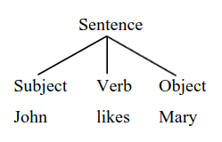
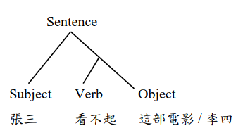
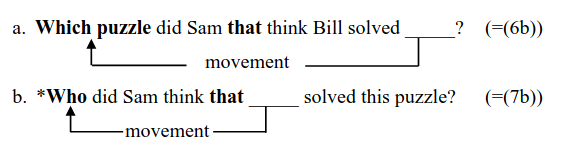

# 句法是什麼？What is syntax?

**作者：周昭廷副教授、王文傑先生**&#x20;

* 語言哲學家威廉·馮·洪堡 (Wilhelm von Humboldt) 提出人類語言是一個「運用有限符號 (如一個語言中的個別字詞) 進行無限組合」的創造力系統 (原文：infinite use of finite means)。根據這個陳述，Chomsky 將這個無限組合的運作原則，也就是語法，放入語言學的研究視角內，檢視離散的 (discrete) 字詞進行「成對融接」 (binary Merge)，逐步「生成語句」的過程。因此，Chomsky 的語法研究理論框架被稱作「生成語法理論」\[2]。
* 所謂**成對融接**是指字詞的組合是兩兩成對的，舉例來說，字串如 _John likes Mary_ 含有「主詞-動詞-受詞」 (Subject-Verb-Object) 三項元素，若不採取成對融接的假設，這三項元素可以如 (1) 所示，同時串連起來形成一個句子。
* (1)

&#x20;

* 然而，生成語言學的研究發現如 (1) 這般的字串序列無法捕捉到人類理解這個句子時的細緻語意差異。以(2) 這組句子為例，主詞 _John_ 的語意是由動詞與受詞的組合決定的，在 (2a) 中的受詞是 _the_ _window_，_John_ 的語意角色是施事主體 (Agent，即主動促成事件發生的角色)，在 (2b) 中，受詞是 _his_ _arm_，_Joh&#x6E;_&#x7684;語意角色則是經歷主體 (Experiencer，即受到事件發生影響的角色)。
* (2)
  * a. John broke the window.&#x20;
  * b. John broke his arm.
* 根據此類語意差異，Marantz (1984: 23) 以及Chomsky (1986: 59–60) 都提出，句子的組合順序應該要像是如 (3) 所示，動詞先與受詞進行成對融接，接著才與主詞融接。如此一來，我們才能解釋人類是如何直觀地察覺「 a 句中的 John 是主動鬧事的人」而「b 句中的 John 是受害者」 — 那條斷掉的 arm 可是長在 John 身上的。
* 要能區辨 "John" 究竟是什麼角色，需要先確定 "broke" 的是 "window" 還是 "arm"。這麼一來，就表示人類理解這個句子的時候，不是簡單地由左至右讀下去，而是先確定究竟是 "broke the windows" 還是 "broken his arm" 然後才決定 "John" 在這個句子裡扮演什麼角色。
* 這樣的成對融接組合順序可以很直觀地捕捉到「主詞語意受到動詞+受詞組合決定」這個語言事實。
* (3)

<figure><figcaption></figcaption></figure>

* 更重要的是，生成語言學提出的語法分析追求普世應用性 (universal generalization)，如 (3) 這般的結構，在別的語言也應該適用，在認知科學的層面上才有意義 \[1] 。因為生成語言學研究的對象是「人類的認識系統中，語言系統的運作」，而不是早期傳統語言學只對單一一種語言做的蒐集、標記與分類工作。
* 因此，不只是英文，我們也能在中文裡看到類似的現象。舉例來說，在 (4) 之中，動詞「看不起」可以有兩種意思，在 (4a) 中的意思是「沒有足夠的錢進場觀賞」，在 (4b) 中是「瞧不起、鄙視」的意思。(4a) 與 (4b) 這兩種語意的差異是由受詞「這部電影 / 李四」，而不是主詞「張三」決定的。換句話說，若只看「張三看不起…」這個部分，我們無法決定「看不起」是屬於哪一個意思\[2]。
* (4)
  * a. 張三看不起這部電影。&#x20;
  * b. 張三看不起李四。
* 為了呈現這樣的語意差異，我們可以沿用 (3) 的結構到中文，繪製圖 (5)。在圖 (5) 中，動詞與受詞成對融接，決定了動詞語意後，再與主詞進行成對融接。
* 人類語言便是根據這個成對融接的運行原則，**組合適當的有限符號 (如一個語言中的個別字詞) 產生離散無限性的階層結構 (hierarchical structure with discrete infinity)**\[3]。
* (5)

<figure><figcaption></figcaption></figure>

* 然而，成對融接的無限組合有其限制，並不是所有生成的語句都是合語法的。舉例來說，生成語法學家觀察到 (6) 之中的兩個受詞疑問句，無論有沒有 _that_ 引介子句，都合乎英文語法，但在 (7) 之中，將疑問詞改為主詞 _who_ 之後，有 _that_ 引介子句的 (7b) 就出錯了 (Perlmutter 1968)。針對 (6) 與 (7) 的實證觀察，生成語法學家提出各式可能的假設與分析 (可參考 Pesetsky 2017 以及 Erlewine 2020 的回顧與討論)。
* (6)&#x20;
  * a. Which puzzle did Sam think Bill solved?
  * b. Which puzzle did Sam think **that** Bill solved?
* (7)
  * a. Who did Sam think solved this puzzle?
  * b. \*Who did Sam think **that** solved this puzzle?
* _<mark style="color:blue;">**\[註] 語言學中，將一個句子的開頭打上星號 \* 表示這個句子不合文法；若打上問號，則表非句子不自然。**</mark>_
* **為了評估各類分析的適切程度 (adequacy)，Chomsky (1965) 在生成語言學發展早期，便提出了 (8) 的三個語法理論適切性層級，作為評估標準。**
* 一個針對英語的語法理論，最基本的要求就是滿足觀察適切性，也就是能夠正確分辨 (6) 與 (7) 的對比，指出 (7b) 是錯誤的英文語句\[4]。
* (8)
  * a. 觀察適切性 (observational adequacy)：\
    針對語言事實 (合法度以及語意區辨) 做出準確的分辨。
  * b. 敘述適切性 (descriptive adequacy)：\
    針對前項 (8a) 的觀察，提供明確描述以及通盤性規則 (generalization)。
  * c. 解釋適切性 (explanatory adequacy)：\
    解釋人類孩童如何習得前項 (8b) 的通盤性規則。
* 接著，針對 (7b) 提出的假設與分析必須**穩定**，能夠**有明確的描述以及通盤延伸性或預測能力**，才能滿足敘述適切性。生成語言學理論中除了成對融接這個基本運行原則，還允&#x8A31;**「移位」 (movement)**，也就是字詞成對融接後，可以繼續移動至結構之中其他位置。舉例來說，(6) 與 (7) 之中的 _wh_ 詞，分別是動詞 _solved_ 的受詞與主詞，英語的 _wh_ 詞可以如 (9) 所示，藉著移位至句首形成疑問句。
* (9)

<figure><figcaption></figcaption></figure>

* 生成語法學家發現**移位留下的空缺位置會影響語句的合法度**。
* (9b) 中移位留下的空缺，緊鄰引導子句的銜接詞 _that_，因此提出「移位空缺不能緊鄰子句銜接詞」的分析。
* 這個分析滿足了敘述適切性，因為它能夠正確預測不同語意且使用不同字詞的 (10b) 也是不合法的英文語句，因為在 (10b) 之中，_what_ 的移位留下的空缺也緊鄰子句銜接詞 _that_。
* (10)
  * a. What do the authors think \_\_\_\_\_ caused this problem in ChatGPT?
  * b. \*What do the authors think **that** \_\_\_\_\_ caused this problem in ChatGPT?
* 這個分析的敘述適切性不只體現於預測 (10b) 是不合法的，它還預測若是我們可以隔離 _that_ 與 _wh_ 詞移位留下的空缺，(9b) 與 (10b) 會變為合法。
* 的確如此，Bresnan (1977) 與 Culicover (1993) 都指出當我們在 _that_ 之後，加入副詞如 _fortunately_ 時，(11a) 與 (11b) 都變成合法句了，因為 _wh_ 詞移位留下的空缺不再緊鄰子句銜接詞 _that_ 了。
* (11)&#x20;
  * a. Who did Sam think **that** **fortunately** \_\_\_\_\_ solved this puzzle?
  * b. What do the authors think **that** **unfortunately** \_\_\_\_\_ caused this problem in ChatGPT?
* _Wh_ 詞移位留下的空缺不能緊鄰子句銜接詞的限制，不只適用於英語，還可以在許多不同的語言中發現相同的現象。
* 如 (12) 所示的阿拉伯語，_wh_ 詞移位留下的空缺若是緊鄰子句銜接詞 _innu_，(12a) 便不合法；而 (12b) &#x7684;_&#x77;h_ 詞移位留下的空缺本就不緊鄰 _innu_，因此為合法句。
* (12)
  * a. ʔayy bint Fariid kaal **(\*innu)** \_\_\_ ištarat l-fusṭaan? (Kenstowicz 1989: 264)\
    &#x20;   which girl Fariid said that            bought the-dres\
    &#x20;   ‘Which girl did Fariid say (\*that) bought the dress?’
  * ʔayy fusṭaan Fariid kaal **(innu)** l-bint ištarat \_\_\_?\
    which dress Fariid said   that the-girl bought\
    ‘Which dress did Fariid say (that) the girl bought?’\\
* 以上關於敘述適切性的討論都環繞於一個核心分析：**移位會留下空缺，且空缺的位置會影響語句合法度**。
* 這個分析的通盤延伸性還可以從另一個英語結構「_wanna_ 縮寫」得到證明。(13a) 與 (13b) 顯示 _want_ 與 _to_ 可以縮寫為 _wanna_，但是當移位空缺位於 _want_ 與 _to_ 之間時，從 (13c) 改為 (13d) &#x7684;_&#x77;anna_ 縮寫便不合法了。
* 總而言之，**我們在不同的結構，不同的語言中，都看到移位空缺的位置會影響語句合法度，因此「移位留下空缺」這個分析具有通盤延伸性，合乎描述適切性的條件**。
* (13) 英語的 _wanna_ 縮寫：
  * a. What does John want to buy \_\_\_?
  * b. What does John **wanna** buy \_\_\_?
  * c. Who does John want \_\_\_ to solve the problem?
  * d. \*Who does John **wanna** solve the problem?

***

\[1] 腦照影研究也發現成對融接與字串序列這兩種組合方式是由兩個不同的腦區負責的 (Moro et al. 2001; Friederici 2004; Opitz & Friederici 2004; Amunts & Zilles 2012; Zaccarella & Friederici 2015a, b)。&#x20;

\[2] (4a) 當然也可以有「瞧不起、鄙視」的意思，但這不影響此處的重點：主詞、動詞與受詞的組合並不是同 步串聯，而是成對融接，逐步形成階層結構。

\[3] 澳洲原住民語言 Walpiri 中的主詞、動詞、受詞的語序可以自由變化，且基本語意不變 (Hale 1983)。此類 語言表象上語序自由，缺乏結構，但 Kiss (1995) 以及 Legate (2002) 透過深入、嚴謹且多面向的討論與驗證， 結論是這個語言的語句生成原則仍是運用離散成對融接，產生階層結構。

\[4] 有些學者認為生成語言學詢問母語者合法度以及語意判斷的做法缺乏嚴謹的實驗設計，因此實驗結果不可靠，不能作為科學理論建構的研究方法 (Edelman & Christiansen 2003; Ferreira 2005; Wasow & Arnold 2005; Gibson & Fedorenko 2010, 2013)。然而，Jon Sprouse 透過一系列的量化實驗研究 (Sprouse and Almeida 2012; Sprouse et al. 2013; Sprouse & Almeida 2017)，比較少量母語者的語句判斷結果以及大規模實驗收集的判斷數據，發現兩者的結果沒有顯著差異。
